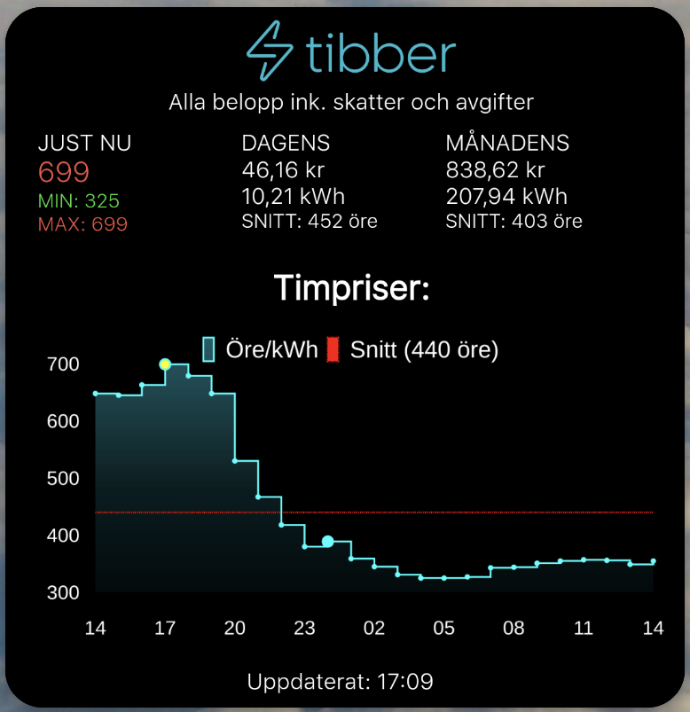
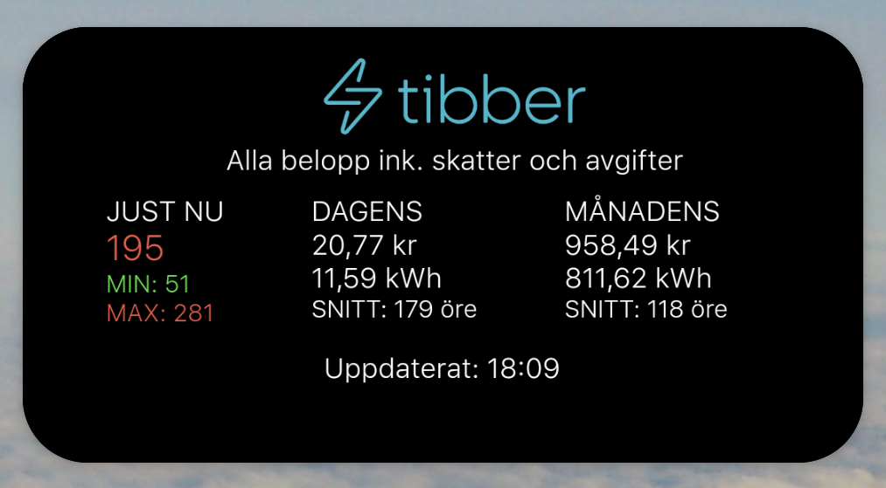
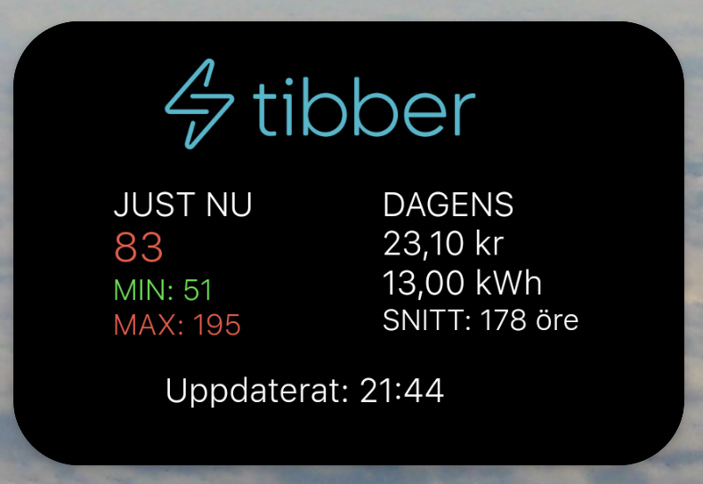
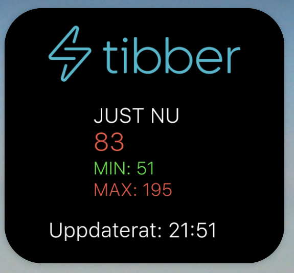
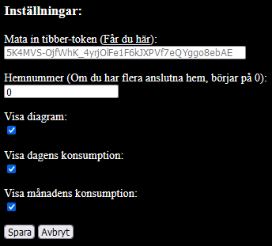

## TibberWebWidget

Web widget for Tibber to use in Widgets which can show webpages.

### Based on
https://github.com/svenove/iOSTibberWidget

### You can host it youself or use this url:
https://witty-plant-032206603.2.azurestaticapps.net/

### Why host a simple html/js page:
I haven't find any solution to use this on android (probably the same problem for iOS) mobiles with locally files, for web widget apps has not access to locale files. But you can host it with a locale webhost on your device if you want to, but will drain your battery.

### What to use to widget in:
I can recommend [Widgetify](https://play.google.com/store/apps/details?id=com.binarysmith.webclipwidget.ad) for Android, I has no iOS unit so your are on your own what to use there.